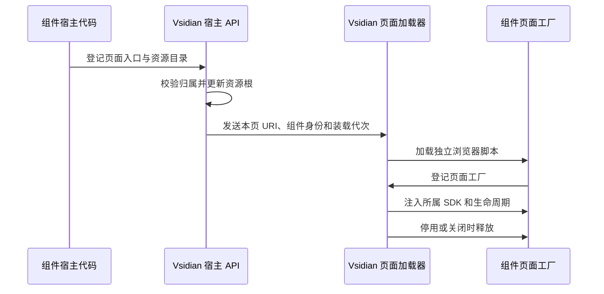

# Vsidian 附加组件：接口与装载技术方案

状态：2026-10-05 的第一版技术提议。产品规则以 [ADR-0012](../adr/0012-vsidian-addons-distribution-api-governance.md) 和[规格](../specs/vsidian-addons.md)为准；本文收敛实现路线，尚未发布 SDK。字段、接口名称与首个 API 版本仍须随公开声明和消费样例冻结。

**实施进度**：T01（#350，2026-10-07）已将第 2 节的身份发现、兼容检查与轻量注册接入生产路径（`src/shared/addonIdentity.ts`、`src/host/addons/`、设置页「附加组件」分页），并携带三个测试夹具扩展（`test/integration/addonFixtures/`）作为消费样例；真宿主集成测试覆盖两条激活路径、重复注册与清单刷新。T02（#351，2026-10-07）已将第 3、4 节的两生命周期与页面装载接入生产：`registerAddon` 含 `setup`/`enable` 与页面入口注册（`settings.registerPage`/`pages.registerEditor`）形状，运行生命周期由 `src/host/addons/addonRuntime.ts` 驱动（普通关闭释放运行贡献保留设置能力、偏好持久、可归因异常全组件暂停）；页面 SDK 与装载协议契约在 `src/shared/addonPage.ts`，生产装载器 `src/webview/addonPageLoader.ts` 并入 main/settings 两入口，编辑器扩展挂载槽为 `liveInstance` 扩展数组末尾的 Compartment（V02 放行结论的生产缺口已闭合）；实验入口表登记 `cm6@1.0.0`。设置页分页新增功能开关与组件设置页挂载区。验证：单元（生命周期/装载器/登记校验/设置页 UI）、浏览器生产路径（`test:browser` 的 addonPageSdk 套件——真实键盘/IME/绘制层）与真宿主集成（`test/integration/suite/addonT02Cases.ts`——生产编辑器/设置页面板装载夹具组件）。T04（#353，2026-10-07）已将第 5.5 节的设置能力面接入生产：复杂设置定义（标量/数组/对象一层结构）经 `settings.registerDefinitions` 按组件隔离注册（`src/shared/addonSettings.ts` 形状校验矩阵），`src/host/addons/addonSettingsService.ts` 承担按批原子保存与用户默认/工作区两层持久化（存储 v1 冻结 fail-safe；变化事件只在持久化成功后发出），setup context 暴露 `get/getSource/update/clearWorkspaceOverride/onChanged`；设置页「附加组件」分页新增平台基础设置区（双标签作用范围、标量/数组重复项/对象字段基础控件、逐项「使用用户默认」清覆盖、失败不虚报反馈——`src/webview/addonSettingsSection.ts`），功能开关同样支持两层；消费样例为夹具 `addon-t04`（`test/integration/suite/addonT04Cases.ts` 六用例）。验证：单元 69 例（模型/服务/runtime/设置区 UI）+ 浏览器 addonSettings 套件（真实键盘与绘制层）+ 真宿主六用例。宿主侧 realpath 符号链接校验仍归 T05；侧栏三分组与自定义页完整呈现归 T05。已实现部分仍是草案形状，不冒充已发布稳定 API。

**安装后即可使用，作者通过代码注册能力**。清单负责识别与兼容，Vsidian 负责生命周期、设置和行为协调。输入与渲染代码在页面运行，宿主端保留权威文本和持久化能力。

验证与实施已拆为[批次票据](../specs/batch-2026-10-vsidian-addons.md)：总览 #347、验证 #348/#349、实施 #350–#367。开票不等于验证通过或 API 已发布；受验证结果影响的票须满足明确放行条件再实施，发现与轻量注册可独立推进。

## 1. 路线选择与依据

比较了三种页面接入形式：

| 路线 | 对作者和内核的影响 | 本轮结论 |
| --- | --- | --- |
| 将宿主回调经消息桥传入页面 | 消息桥不能传函数；每次输入经宿主往返也不适合作为页面回调 | 不采用 |
| 全部页面改为 ESM，通过原生模块导入 SDK | 需要新产物、导入地址和共享运行时装配；核心现有 IIFE 不能直接充当模块 API | 保留为后续可能性 |
| 组件提供独立 IIFE，由加载器调用工厂并注入 SDK | 保留核心构建；明确两端产物和运行时归属 | 采用此路线继续设计，最小宿主探针通过 |

IIFE 指执行后注册入口的独立浏览器脚本。组件仍可用 TypeScript 模块编写源代码，由构建辅助工具打成该产物，不要求作者手写全局变量。

依据见[接入边界调研](../research/vscode-addon-discovery.md)的「2026-10-05 接口收敛与最小宿主探针」。探针验证基本装配，不代表 Remote SSH、完整输入链或生产卸载已经验收。

## 2. 身份声明与原生激活

### 2.1 清单形状

建议只增加一个顶层私有字段：

```json
{
  "extensionDependencies": ["onegayi.vsidian"],
  "extensionKind": ["workspace"],
  "keywords": ["vsidian-addon"],
  "vsidianAddon": {
    "manifestVersion": 1,
    "api": "^1.0.0"
  }
}
```

这是提议格式，`1.0.0` 是首个稳定 API 的候选版本，当前不存在该公开 API。实验能力需要时另加 `experimental` 兼容声明；具体实验版本标记随入口冻结。

**T01 实施落点（#350）**：上述清单形状已由 `src/shared/addonIdentity.ts` 解析校验（`manifestVersion: 1`、`api` 范围、可选 `experimental` 表；范围求值子集见同仓 `semverRange.ts`）。宿主实验入口表当前为空——任何 `experimental` 声明都判不兼容，如实反映实验入口未发布。官方清单为 `OFFICIAL_ADDON_EXTENSION_IDS`（初版空，登记新官方组件只改该表）。消费样例即测试夹具 `test/integration/addonFixtures/addon-ok`（声明 + 依赖 + 代码注册）。

| 字段或身份 | 责任 |
| --- | --- |
| VSCode `Extension.id` | 唯一组件 ID，沿用 `publisher.name`；不在私有清单重复维护 |
| `manifestVersion` | 身份声明格式版本，与公开 API 版本分开 |
| `api` | 支持的稳定 API 范围；不使用 Vsidian 本体版本代替 |
| `experimental` | 确有使用时声明实验入口及兼容范围 |
| VSCode 名称、作者信息 | 组件列表的基础展示信息 |
| `keywords` | 市场发现辅助，不能据此接受接入或认定官方身份 |

清单不列输入处理、渲染器、命令、设置或第二套激活条件。组件代码是这些能力的唯一注册来源。

官方分类建议由 Vsidian 主仓库维护明确的官方扩展 ID 清单。组件不能自行声明「核心组件」身份；官方组件仍走相同 API 和兼容检查。

### 2.2 发布 API 后再唤醒

Vsidian 的 `activate()` 构造并返回宿主 API。发现协调任务等待自身原生激活完成后，再扫描和唤醒组件；这个任务不能被 Vsidian 的 `activate()` 等待。

先订阅 `extensions.onDidChange`，再做初始扫描。扫描和变化处理按组件 ID 合并；原生激活可以来自 VSCode，也可以来自 Vsidian 的主动唤醒。注册入口对两条路径使用相同的身份、兼容和重复注册校验。

`registerAddon` 接收调用者的原生 `Extension` 身份，并核对当前宿主注册表中的记录。组件尚在自身激活过程中也允许注册，不能要求它此时已经 `isActive`。这个校验用于归属和协议一致性，沿用普通 VSCode 扩展信任模型。

同一接入代次再次注册时返回 `AlreadyRegistered`，不重复调用接入回调。手动重试先释放旧代次，再创建新代次；原生 `activate()` 的缓存不能代替这层注册管理。

首版只接受当前宿主可调用的组件。未发现时显示「当前宿主不可用」并提供 VSCode 管理入口，不能仅凭查询为空判断未安装或装错侧。

**T01 实施落点（#350）**：上述顺序由 `src/host/addons/addonCoordinator.ts` 实现——`start()` 同步返回（先订阅 `extensions.onDidChange` 再发起扫描；扫描先等自身 API 公布，不被自身 `activate()` 等待），按组件 ID 合并在途唤醒；`src/host/addons/addonRegistry.ts` 承担注册校验链与 `AlreadyRegistered`。真宿主实证补充两点 VSCode 1.82.3 语义（已钉入实现与测试）：其一，`Extension.isActive` 表示「已尝试激活」而非「激活成功」——激活失败的扩展 `isActive` 仍为 `true`，协调器须按自身记录短路而不是信 `isActive`；其二，对激活失败过的扩展再次 `activate()` 会假成功（resolve 而非重抛），故不自动重试故障组件（ADR 已确认方向），重试走后续票的手动入口（先释放旧代次）。

## 3. 公开接口与两种生命周期

**设置接入和运行功能分别管理**。宿主轻量注册后，手动停用仍能配置；开启时再装配编辑、渲染、命令和界面能力。

| 提议入口 | 输入与结果 | 生命周期 |
| --- | --- | --- |
| `registerAddon(owner, definition)` | 原生扩展身份、轻量接入及运行回调 → 所属组件释放句柄 | 原生扩展本次接入 |
| `definition.setup(context)` | 注册设置定义、自己的设置页及设置通信 | 普通功能停用后保留；故障暂停时回收组件代码 |
| `definition.enable(context)` | 注册运行功能和编辑器页面入口 | 开启时调用；关闭或故障时释放所属注册 |
| `pages.registerEditor(entry)` | 自身安装目录内的页面产物与资源目录 | 组件运行生命周期 |
| `settings.registerPage(entry)` | 自身设置页面产物与资源目录 | 设置生命周期 |
| `channel.handle(topic, handler)` | 处理本组件页面的 JSON 请求 | 归注册时所在的生命周期 |

`setup` 与 `enable` 的上下文都收集注册和释放句柄。作者可以登记自己的清理回调，平台在退出该作用范围时调用；重复释放应无害。昂贵资源在运行回调、视图挂载或实际业务调用时取得。

普通 API 拒绝与组件异常分开。只读写入、旧实例或版本冲突返回可辨认结果；注册、初始化或回调中的可归因异常仍触发全组件故障暂停。

故障暂停撤下运行功能和自定义设置页代码。平台保留已取得的设置定义、存储值、故障原因和启用偏好，提供基础配置及手动重试。

## 4. 页面产物、资源与 SDK 注入

### 4.1 装载过程



组件只登记安装目录内的相对入口及资源子目录，平台拒绝越出该目录的路径。每个 Webview 分别授权资源根并生成 `asWebviewUri()` 地址，不能复用另一页的 URI。

加载器记录组件 ID、页面实例和装载代次。旧工厂注册、旧消息和迟到结果不能接入新代次。脚本加载顺序与行为执行顺序分开，不能靠哪个脚本先完成下载来决定行为优先级。

加载器使用当前资源源与 nonce，不为组件增加远程脚本源或 JS `unsafe-eval`。当前 CSP 实际包含资源源放行，不能把旧注释中的「仅 nonce」当作现行代码事实。

### 4.2 作者入口与共享运行时

提议由 SDK 的构建辅助工具提供 `defineAddonPage(factory)`。组件脚本只登记工厂；加载器在核对本次入口身份后调用工厂，传入页面 SDK。具体内部桥接名和注册关联方式属于装载实现，不作为作者要记忆的接口。

稳定 SDK 只暴露文本、选区、渲染容器、设置、界面注册和通信接口。CM6 接入位于 `experimental.cm6`，需要使用本页提供的同一套构造器和工厂。

第三方不能通过再次打包 CM6 实现共享。仅将包标记为 esbuild `external` 也不够，IIFE 中的裸 `require()` 不会自动得到页面运行时。构建辅助工具须显式桥接 SDK；消费样例同时检查产物中没有未解析的运行时导入。

SDK 载体建议是由主仓库生成声明、最小页面入口辅助代码和构建辅助工具的独立开发包。包名、发布权限与外部发布另行安排，本轮不创建或发布该包。

## 5. 六组稳定能力的形状

### 5.1 视图、快照与文本提交

| 提议接口 | 结果或职责 |
| --- | --- |
| `views.list()` | 有效实例句柄列表：实例 ID、目标文档 URI、模式、视图类型和可编辑状态 |
| `views.onCreated` / `views.onDisposed` | 所属页面的实例变化订阅 |
| `view.editor.getSnapshot()` | 文本、多选区、权威文档版本和当前快照修订标记 |
| `view.editor.applyEdits(request)` | 文本修改请求 → 宿主确认后的提交凭据或拒绝原因 |
| `view.editor.setSelection` / `reveal` | 选区与定位操作，不强造文本撤销项 |

提交请求包含快照修订标记、LF 坐标的变更列表、可选提交后选区，以及 `history: "atomic" | "joinPrevious"`。省略 `history` 等同于 `atomic`。

修订标记用于识别快照是否仍适用于本次业务修改，不能只看尚未包含页面未确认输入的宿主版本。API 的旧快照调用明确拒绝；内核原有用户输入重定位逻辑继续保留，不能把两者混成任意自动重试。

目标从有效视图句柄取得，来源由 SDK 的组件和行为上下文添加，作者不能把请求伪装成另一组件。公开坐标沿用 UTF-16 偏移，页面文本采用 LF；宿主适配器继续负责行尾转换。

### 5.2 输入行为

`behaviors.register` 登记稳定局部 ID、必填名称、可选说明和例子，以及业务处理回调。局部 ID 与组件 ID 共同组成持久身份，不以显示名作为存储键。

稳定输入回调取得当前快照和操作上下文，返回不处理或文本修饰计划。每个适用行为看到前面行为完成修饰后的状态；默认继续调用后续行为，不能因为产生了文本变化就自动停止整条链。

实际提交的每次修饰仍按自己的原子声明记账。通知监听与输入修饰回调分别注册，`onChanged` 不是自动进入原输入链的第二种写入口。

内核先执行只读、IME、表格与既有情境门控。Tab 等已经确定的固定情境链不能通过新增可绑定命令绕过。确需择一的扩展入口应单独声明独占组，不把全部输入行为改为「第一个处理后停止」。

### 5.3 渲染提供者

`renderers.register` 登记局部 ID、支持语言与模式、挂载及释放回调，可选登记图形导出能力。选择单位是提供者，实际挂载单位是某个视图中的某个代码块。

新安装的兼容且已启用组件成功接入后，自动替换所支持语言的生效提供者。已有文档热切换；用户可以按需调整，也可以改回内置。

建议以 Vsidian 已记录的组件身份和发现批次识别新安装。同批候选按稳定 ID 升序依次接管，最后一个可用候选生效，后续新增批次优先；不声称拿到了 VSCode 未公开的真实安装时间。脚本装载快慢不改变这个顺序，重启、重复注册与普通升级保留已有首选。

自动首选与用户调整要保存来源和稳定提供者 ID。组件没有支持的模式不调用其入口；相关模式的候选筛选在挂载之前完成。

停用后的内置接管和仍运行的渲染 bug，严格沿用 Q30。内置接管不清除原首选；手动恢复成功后重新使用原首选，旧异步结果不得重新挂载。

### 5.4 操作与界面

`commands.register` 提供名称、回调、作用模式及可选默认绑定。每个面向用户的操作都登记到统一快捷键管理，允许默认未绑定。

菜单、按钮和面板通过所属注册句柄新增。稳定 ID 统一加组件命名空间；注册内置 ID、同名替换或修改别的组件贡献明确拒绝。设置页整体导航和内置菜单的归属仍由 Vsidian 管理。

### 5.5 设置

`settings.registerDefinitions` 接收可序列化的设置定义。值为 JSON 普通值、数组或对象；有限数、结构约束、默认值和必要展示信息由定义说明，不通过函数序列化校验器。

`settings.get(scope)` 返回生效值及用户默认／工作区来源；`settings.update(scope, patch)` 按批校验并保存，失败不虚报成功；`clearWorkspaceOverride` 只清除覆盖。变化事件仅在成功保存后发出。

数组使用重复项控件，对象使用字段控件；作者的自定义页可提供更合适的布局。平台始终保留定义和基础控件，供普通停用及故障后的配置使用。组件设置单独命名空间，不把现有内置标量类型直接断言为复杂值。

显示信息随组件代码注册语言表，缺失译文使用声明的默认语言；组件的键不加入 Vsidian 内置字典。平台自己的按钮、状态和错误仍经现有 i18n 字典。

### 5.6 生命周期、通信与诊断

两端请求带组件身份、页面代次、请求 ID 和所属作用范围。`channel.request` 的载荷和结果是 JSON 数据；超时、取消、实例释放及组件暂停都有明确结束结果。不能把 DOM、函数或 EditorView 传到宿主。

日志保留组件、行为或视图、阶段和原因。`diagnostics.reportFault` 与普通错误日志分开；故障暂停由平台执行，恢复使用已有手动重试入口。

## 6. 原子修饰与宿主历史分组

**保持 VSCode 文本撤销栈，增加来源与分组记录**。不在 CM6 中再安装一套文本 history，也不通过撤销后重写全文来伪造合并。

VSCode 1.82.3 的 `WorkspaceEdit` 会建立并关闭一条原生历史项，不能靠后一次 `TextEditor.edit(..., { undoStopBefore: false })` 把它重新打开。最小探针已核实这一限制。

因此，产品里的「一次原子操作」和底层可能存在的多条宿主历史项需要明确区分：

| 场景 | 技术路线 |
| --- | --- |
| 原子修饰及随后非原子修饰尚未提交 | 在保留各次来源记录的前提下，能合并的提交合成一笔 WorkspaceEdit |
| 上次原子操作已经提交，随后又提交非原子修饰 | 为新增宿主历史项记录同一原子操作 ID；一次撤销／重做请求连续执行该组需要的原生步骤 |
| 原生编辑器或宿主入口先执行了一步撤销／重做 | 观察目标文档的 Undo／Redo 回流，完成该组剩余步骤；避免重复执行 |

例子：A 是原子修饰，B 是非原子修饰，C 又开一个原子操作，D 是非原子修饰。来源记录保留 A、B、C、D 四次变化；用户撤回和重做的单位是 `A+B`、`C+D`。

最小探针分别在原生编辑器和 CustomTextEditorProvider 中得到 `ABCD → AB → 空 → AB → ABCD`。该结果证明顺序请求下的基本路线可行，**没有证明并发、IME、引用目标、失败收尾或重载后的完整性**。

历史协调模块需要承担这些实现要求：

- 按目标文档串行执行历史请求，识别本次连续步骤及外部 Undo／Redo；每次推进都核对预期回流，不能仅循环执行 N 次全局命令。
- 嵌入 B 文档的整组历史操作沿现有目标激活路线执行，整组完成后才恢复来源 A 面板，不能中途切回 A。
- 来源日志保留每次修饰及其原子操作 ID；原生记录与分组的映射失去对应时明确停止协调，不猜测或撤销其他文档。
- `joinPrevious` 没有可确认的同目标前项时拒绝提交并返回 `HistoryBoundaryUnavailable`，不能静默省略跟踪或变成另一种撤销语义。
- Undo 后新写入会截断 Redo 分支；组合期、失败中断、重复快捷键及外部写入都要验证；重载后的分组恢复要与宿主历史实际保留状态对应。

探针用了独立测试组件和固定、互不重复的文本状态。生产实现不能依赖这种简化匹配，必须接入现有版本、增量和确认管线。上述测试完成前，不发布已经满足完整历史契约的声明。

## 7. 管理状态与持久化

运行状态和用户偏好分别记录：

| 记录 | 归属与用途 |
| --- | --- |
| 已发现组件、声明及兼容结果 | 当前扩展宿主目录；用于接入与原因展示 |
| 官方组件 ID 清单 | 主仓库维护；用于核心／第三方分组 |
| 用户默认和工作区覆盖 | 组件开关及其设置；按定义持久化 |
| 行为顺序和逐项开关 | 组件 ID + 局部行为 ID；新项加入不破坏已有相对次序 |
| 渲染首选、来源及发现批次 | 自动接管与按需调整；普通重启和升级恢复 |
| 页面代次与故障状态 | 本次接入与挂载；用户启用偏好独立保存 |
| 修饰来源与原子分组 | 同目标文档的历史协调，不作为第二套文本撤销栈 |

行为初始次序建议按稳定 ID 确定；保存了用户排序后，已知行为保留相对顺序，新项追加。未知或暂不可用项保留配置，展示状态而不重新打开用户已经关闭的项。

安装触发的自动接管要与用户默认／工作区覆盖的保存一致。并行窗口不得仅靠激活先后重复覆盖首选；发现批次的幂等处理属于实现验证项。

## 8. API 文档与兼容检查的落点

建议主仓库集中维护三类事实源：公开声明、结构化语义清单、发行台账。指南与版本参考引用它们；历史基线绑定实际发行 Git 证据，不能直接用当前声明冒充旧版本。

| 检查 | 完成条件 |
| --- | --- |
| 基线可信 | 发行锚点、声明、语义和日期可核对，先于兼容检查运行 |
| 类型兼容 | 三类公开消费样例可编译；删除和收窄负向样例被发现 |
| 行为兼容 | 目标归属、坐标、生命周期、历史、故障和自动渲染等关键语义有公开接入测试 |
| 文档新鲜 | 从声明和语义生成的参考与版本索引无未提交差异 |
| 弃用期限 | 从实际 API 发布日起，同时满两个后续 API 次版本和 30 天 |
| 包内容 | 组件运行入口和资源完整；开发文档不要求进入 Vsidian VSIX |

AGENTS 只保留触发入口，正文留在规格和技术方案。正式门禁、公开声明和 SDK 开发包仍需实施，不把本文示意当成已存在命令。

## 9. 验证顺序与当前证据

本轮两次定向宿主探针均退出 0。第二次增加历史分组验证，9 条观察记录覆盖接入顺序、页面装载、Custom Editor 上下文和四种原生历史情况，以及两种编辑器中的分组撤销与重做。细节见[研究记录](../research/vscode-addon-discovery.md#2026-10-05-接口收敛与最小宿主探针)。

后续按以下顺序接入生产，前一步的公开消费路径通过后再展开下一步：

1. 发现、兼容和轻量注册，公开声明及输入／渲染／界面三类消费样例。（T01 #350 已落地发现/兼容/轻量注册与夹具消费样例；公开声明文档与三类正式消费样例待后续票。）
2. 编辑器页与设置页的资源、工厂装配、普通停用和故障释放；补资源拒绝对照及实际 CM6 扩展接入。
3. 输入行为、权威写回和历史协调；覆盖 IME、连续操作、引用 B、原生入口、失败和重载。
4. 渲染自动接管、已开文档热切换及首选恢复，设置分组、作用范围和行为冲突管理。
5. Remote SSH、安装态双 VSIX、可信历史基线和兼容门禁；整理人工验收记录。

实际改动页面 DOM、样式、CSP 或资源加载前执行项目 style-contract 流程。本轮仅有文档和隔离探针，没有修改生产 DOM、CSS 或文本管线。
