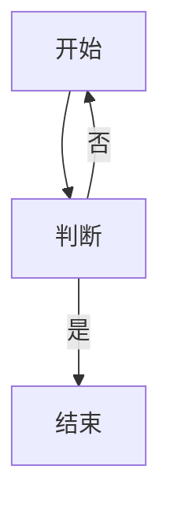
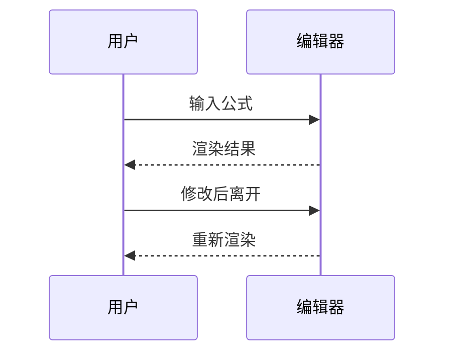
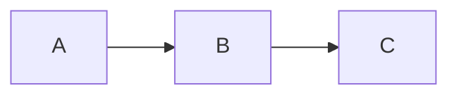
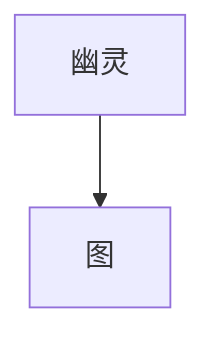
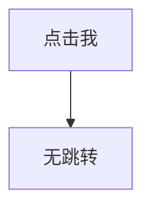

# Vsidian 二期观测夹具（#57 / #59 / #60）

> **这个文件本身就是夹具**。用 Vsidian 打开它，按每站的「做 / 看」指引逐站操作。
> 编号与《vsidian-57-60-人工验收清单.md》一一对应，观测结果可直接记到清单的 F 表。
>
> 模式速查：标题栏 📖=阅读、✏️=实时预览、`</>`=源码；三态按钮循环切换。
> 反直觉但正确的行为（拒绝类）已在对应站内说明，不是 bug。

---

## 站 A5｜整表删除 + 一步撤销

**做**：从本站表格上方的「删除我上沿」拖选到表格**下方**的「删除我下沿」，按 Delete；然后 Ctrl+Z。

**看**：表格 Markdown 整块移除，两句正文保留；Ctrl+Z **一次**恢复整张表。保存重开后磁盘无残留管道。

删除我上沿

- [x] 是
  - [ ] 的

- 送
  - 的

| 甲 | 乙 |
| --- | --- |
| 一 | 二 |
| 三[[a \|b]] | 四 |

删除我下沿

---

## 站 A6｜跨格 IME 与粘贴

**做**：跨格==建立==选区后，启动中文 IME 输入；再粘贴多行文本 `第一行<回车>第二行`；再粘贴 `a|b` 与 `` `x|y` ``。

**看**：先清空可见选区再接收输入；格内换行保存后变 `<br>`（源码态可见），表格源行不拆散；`a|b` 被转义为 `a\|b` 不破坏列结构；`` `x|y` `` 原样保留不转义。

[文 字](含 空格路径)
[[a#^Ss|b]]

---

### 站 A7/A8｜两类「拒绝是预期」的行为

**做 A7**：跨格选区罩住下表的**表头行全部格内容**（「名」「值」都要选进），按 Delete。
**看 A7**：**无反应 = 预期行为**（表头全空白会使整表静默降级，防护整笔拒绝）。想看证据：打开 Webview 开发工具，控制台有 `[vsidian] 跨格选区编辑被拒绝`。

**做 A8**：单击下表分隔行（`---` 行位置）——可就地编辑源码（此入口保留）；然后 Shift+End 扩选再键入。
**看 A8**：扩选后的编辑同样被拒绝（分隔行是隐藏结构）。

| 名 | 值 |
| --- | --- |
| 甲 | 1 |

---

## 站 B1/B2｜公式双视图与混排

**做**：本站保持渲染态，分别在实时预览 / 阅读模式间切换，再切源码态。

**看**：行内与块级公式都渲染为 KaTeX 排版（**衬线数学字体，不是系统等宽字体**——若变等宽说明字体管线失效，请记录）；两模式排版一致；源码态显示原文。

质量能量关系 $E=mc^2$ 与段内 $$a^2+b^2=c^2$$

相邻 $x_1$ 与 $x_2$ 公式，以及 $`1+1`$ 反引号形态——四处独立渲染、互不吞并，基线对齐自然。

---

## 站 B3/B4｜美元与代码区排除

**做**：直接看渲染态。

**看**：以下都不渲染为公式、原文保留。

价格 $5，合计 $10 元；转义形式 \$5 也不触发。

行内代码 `$x$` 保持源码。下面的围栏代码块里的 `$x$` 同样保持源码：

```text
求值 $x$ 于代码块
```

---

## 站 B5/B6/B7｜编辑进出、降级与跨行块

**做 B5**：把光标移进上面 B1 站的任一公式（或直接**鼠标点击**渲染态公式）——显源码；输入中文（IME）改几个字符；光标离开——恢复排版。

**做 B6**：看下面这条非法公式。**看**：浅红底、等宽的原文降级态（这个颜色呈现没有任何自动化断言，纯靠你的眼睛），邻近正文可正常编辑。

非法公式：$\notdefined{x}$ 结束。

**做 B7**：光标进下面的多行块——显源码可编辑；离开恢复。长公式应横向滚动不折行。

$$
\begin{aligned}
S &= \sum_{n=1}^{\infty}\frac{1}{n^2}=\frac{\pi^2}{6} \\
\Gamma(z) &= \int_0^\infty t^{z-1}e^{-t}\,dt
\end{aligned}
$$

---

## 站 C1/C2｜Mermaid 双视图与同源多图

**做**：光标不进围栏时看渲染；切阅读模式对照；再切源码态看原文。然后比较本站两个**完全相同**的图。

**看**：三种图各自渲染为图；两模式一致；同源两图缩放一致、无错乱。






---

## 站 C3/C4｜编辑重渲染与降级

**做 C3**：光标进入上一站任一围栏——显源码；把「输入公式」改成「粘贴图片」；离开——按新源码重渲染；退格复原——渲染复原。

**做 C4**：看下面的非法图。**看**：错误提示 + 可读源码（浅红左边线），**它后面的正文和下一张图不受影响**；把语法修对后恢复渲染。

```mermaid
这不是合法的 mermaid 语法
```

降级不影响我，我也应该是一张正常的图：



---

## 站 C5｜伪围栏排除

**看**：下面四个都不应渲染为图——外层四反引号内的、缩进 4 空格的、Tab 缩进的、普通语言围栏。

````md

````

    ```mermaid
    graph TD
        缩进 --> 图
    ```

（下面这条用 Tab 缩进——终版预期不渲染）

	```mermaid
	graph TD
	    Tab --> 图
	```

```js
const notMermaid = true
```

---

## 站 C6｜图内链接不导航

**做**：点击下图的「点击我」节点。

**看**：不跳转、不执行任何东西（strict 安全档，链接以纯文本呈现）。



---

## 站 C7｜明暗主题联动

**做**：保持本文档打开，切换 VSCode 浅色 ↔ 深色主题（Ctrl+K Ctrl+T）。

**看**：已渲染的图以对应主题**重新渲染**（深色下文字线条可读），无需重开文档；表格、公式配色同步变化。

---

## 站 C8/C9｜密集文档与懒加载（选做）

**做**：快速滚动整个文件来回数次；打开 Webview 开发工具 Network 面板刷新一次。

**看**：滚动流畅、图按视口出现、回滚明显快于首见（缓存命中）；Network 里 mermaid.js 恰好请求一次（本文档有图，应加载一次）；打开一个**无图文档**时应无 mermaid.js 请求。

---

## 站 E1/E2/E5｜共存、模式循环与撤销

**做**：回到文件顶部快速扫一遍（表格 + 公式 + 图全在同一文档）；用标题栏三态按钮循环 live → reading → 源码若干部回；对 A5 整表删除、B1 公式内编辑、C3 围栏内编辑各做一次 Ctrl+Z。

**看**：三特性互不干扰；模式切换瞬间完成、切换本身**不产生未保存标记**（右上角无 ●）；三处撤销各一次到位。

---

*夹具版本：b749f0c（2026-09-25，分支 feature/57-60-math-mermaid-table 终稿）*

## 站 A4｜部分跨格删除

**做**：从「苹果」拖选到「香蕉」的末尾（只覆盖两格内容），按 Delete；再试直接键入字符替换选区。

**看**：只有选区覆盖的格内容被删/替换，管道符与分隔行原样保留，被删空的格留空白填充，列数不变；表格仍是表格。

---

## 站 A1–A3｜表格拖选与端点收缩

**做**：在下表任一格内容上按住左键，横向拖到同行右格、再纵向拖到下一行；试着把落点停在格间缝隙、分隔行、表格边缘。

**看**：选区跨过列/行边界延伸到对侧格的可见内容；落点在隐藏结构上时选区端点自动收缩到最近的可见文字边界——**你永远看不到选区高亮盖住管道符或分隔行**。双击选词、三击选格仍限原格。

| 水果 | 数量 | 单价 |
| --- | --- | --- |
| 苹果 | 3 | 5.5 |
| 香蕉 | 5 | 2.8 |
| 樱桃 | 12 | 18.0 |

---
